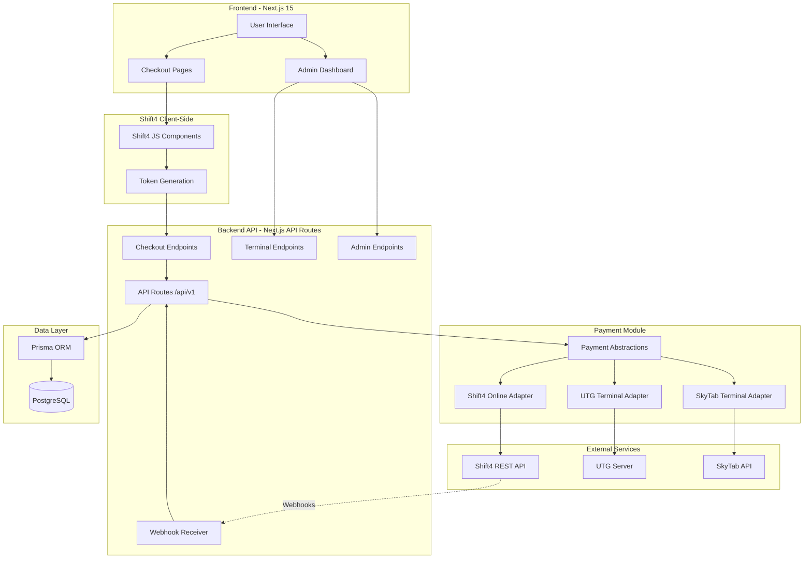
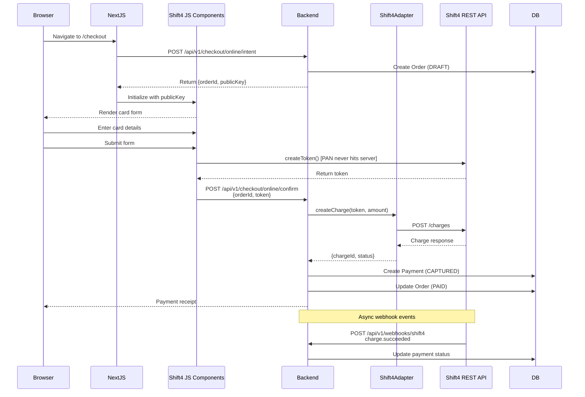
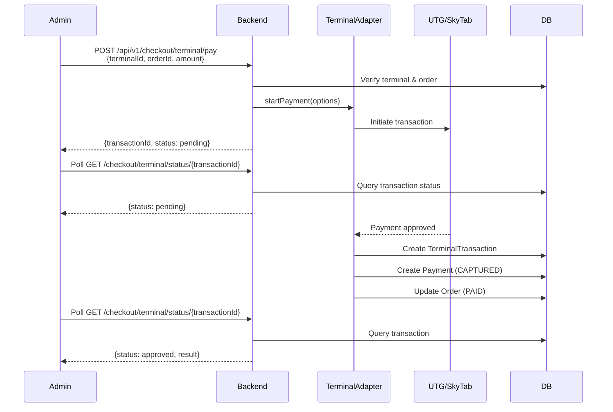
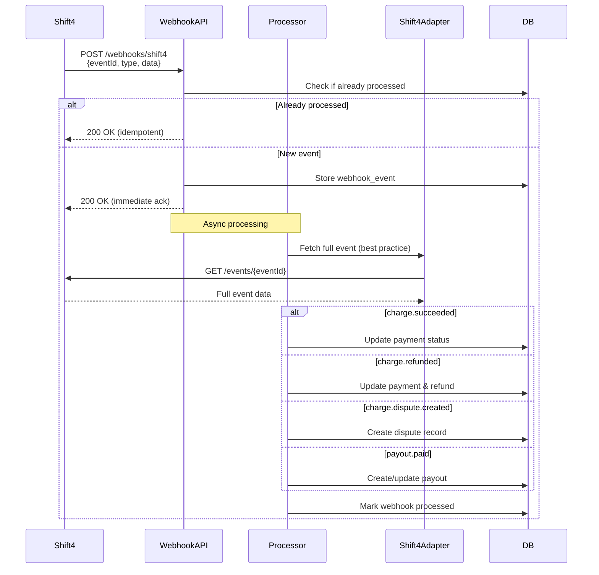
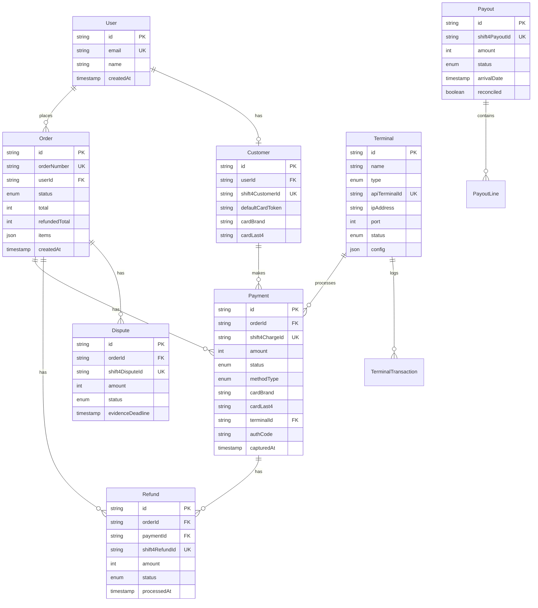
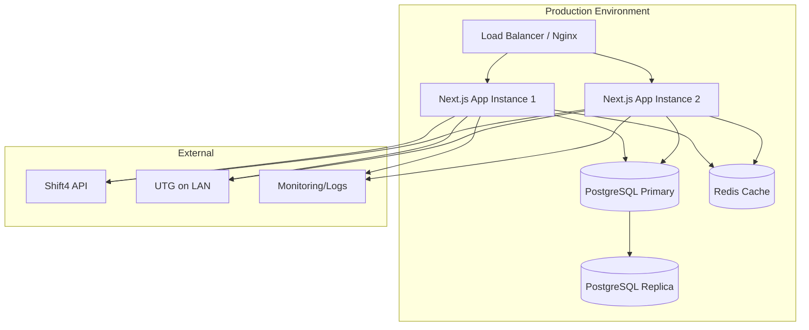

# Architecture Overview

## System Architecture



## Online Payment Flow



## Terminal Payment Flow



## Webhook Processing Flow



## Database Schema



## Component Structure

```
src/
├── app/                    # Next.js 15 App Router
│   ├── page.tsx           # Homepage
│   ├── checkout/          # Checkout pages
│   ├── admin/             # Admin dashboard
│   └── api/v1/            # API routes
│       ├── checkout/      # Checkout endpoints
│       ├── terminals/     # Terminal management
│       ├── refunds/       # Refund endpoints
│       ├── webhooks/      # Webhook receiver
│       └── payouts/       # Payout endpoints
├── payments/              # Payment module (core)
│   ├── types.ts          # Type definitions
│   ├── errors.ts         # Custom errors
│   ├── logger.ts         # Logging utilities
│   └── adapters/         # Payment adapters
│       ├── shift4-adapter.ts    # Online payments
│       ├── utg-adapter.ts       # UTG terminals
│       └── skytab-adapter.ts    # SkyTab terminals
├── lib/                   # Shared utilities
│   ├── db.ts             # Prisma client
│   └── api-utils.ts      # API helpers
└── components/            # React components
    └── ...
```

## Security Architecture

### PCI Compliance
- **No PAN Storage**: Card numbers never touch the server (Shift4 JS Components tokenization)
- **Token-Based**: All payments use tokens from Shift4
- **P2PE Terminals**: UTG/SkyTab handle encryption at point of interaction

### API Security
- Environment-based secrets (`.env`)
- Idempotency keys for payment operations
- Webhook signature verification (if enabled by Shift4)
- Network IP whitelisting for webhooks

### Data Security
- PostgreSQL with encrypted connections
- Audit logging for all payment operations
- PII redaction in application logs
- Separate test/live mode configurations

## Deployment Architecture



## Scaling Considerations

1. **Horizontal Scaling**: Multiple Next.js instances behind load balancer
2. **Database**: Read replicas for reporting queries
3. **Caching**: Redis for session data and frequently accessed data
4. **Queue**: Background job processing for webhooks (BullMQ, Inngest)
5. **CDN**: Static assets via CDN
6. **Monitoring**: Application performance monitoring (APM)
